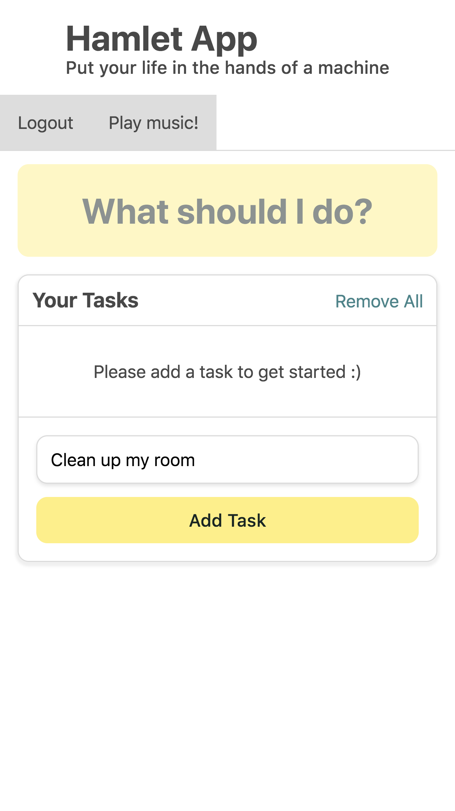
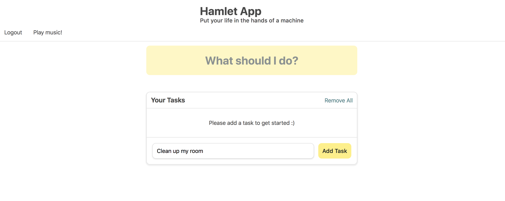

# Hamlet App
## Put your fate in the hands of a machine.

Mobile version

Desktop version

This project uses React to build a to-do list client-side app. User entered tasks are stored in the browser's LocalStorage.

Babel configurations can be found in `.babelrc`

Webpack configurations can be found in `webpack.config.js`.

# Dependencies

[Babel](https://babeljs.io/) - JavaScript transpiler that converts ES6 to plain vanilla JavaScript.

[babel-eslint](https://github.com/babel/babel-eslint) - Lints Babel code not supported by ESLint.

[babel-preset-env](https://github.com/babel/babel/tree/master/packages/babel-preset-env) - Babel preset that transforms ES2015+ down to ES5. Automatically determines the Babel plugins and polyfills you need based on targeted browser or runtime.

[babel-preset-react](https://babeljs.io/docs/plugins/preset-react/) - Babel preset that transforms JSX into createElement calls.

[Express](https://expressjs.com/) - Minimal Node.js framework.

[normalize.css](http://necolas.github.io/normalize.css/) - Renders elements consistently across browsers.

[React](https://reactjs.org/) - Webpack plugin for Babel.

[ReactDOM](https://reactjs.org/docs/react-dom.html) - Provides DOM-specific methods and renders React components.

[react-modal](https://github.com/reactjs/react-modal) - Accessible modal dialog component for React.

[Webpack](https://webpack.js.org/concepts/) - JavaScript module bundler and task runner. Can also be used to transform and package just about any asset. Emits a single file `bundle.js`.

[Webpack DevServer](https://webpack.js.org/configuration/dev-server/) - A developvement server using Webpack that provides live reloading.

# Webpack Plugins
[babel-loader](https://github.com/babel/babel-loader) - Transpiles JS files using Babel and Webpack.

[babel-plugin-transform-class-properties](https://babeljs.io/docs/plugins/transform-class-properties/) - Babel plugin for transforming class properties so there is no longer need to bind the `this` context with `this.someHandler = this.someHandler.bind(this);`. Current class syntax for JavaScript only allows you to define methods inside the class but not properties. This plugin enables properties.

[css-loader](https://github.com/webpack-contrib/css-loader) - Resolves `@import` statements like `import/require()`.

[mini-css-extract-plugin](https://github.com/webpack-contrib/mini-css-extract-plugin) - Used to extract CSS from bundle into a separate CSS file.

[node-sass](https://github.com/sass/node-sass) - Provides Node binding to LibSass, the CSS preprocessor written in C. 

[sass-loader](https://github.com/webpack-contrib/sass-loader) - Compiles SASS into CSS using `node-sass`. Requires `node-sass` and `webpack` as peer dependencies.

# Storybook Addons

[Storybook](https://storybook.js.org/basics/guide-react/)

[Storysource](https://github.com/storybooks/storybook/blob/master/addons/storysource/README.md)

[Actions](https://github.com/storybooks/storybook/tree/master/addons/actions)

[Notes](https://github.com/storybooks/storybook/tree/master/addons/notes)

[Options](https://github.com/storybooks/storybook/tree/master/addons/options)

## Instructions
`npm run dev-server` to run `webpack-dev-server`, visit `localhost:8080`.

`npm run build:prod` to run production build.
`npm run build:dev` to run development build.

Do `yarn install` if you want Storybook to run properly.

`yarn run storybook` to start Storybook, visit `localhost:9001`.